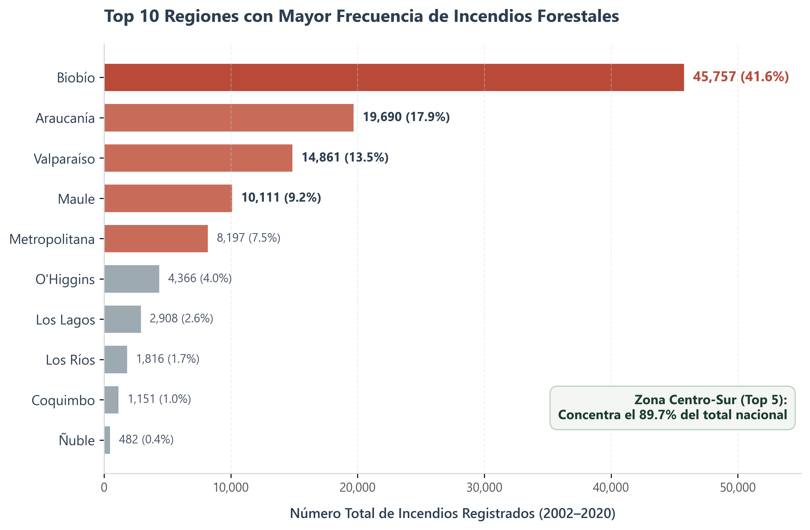
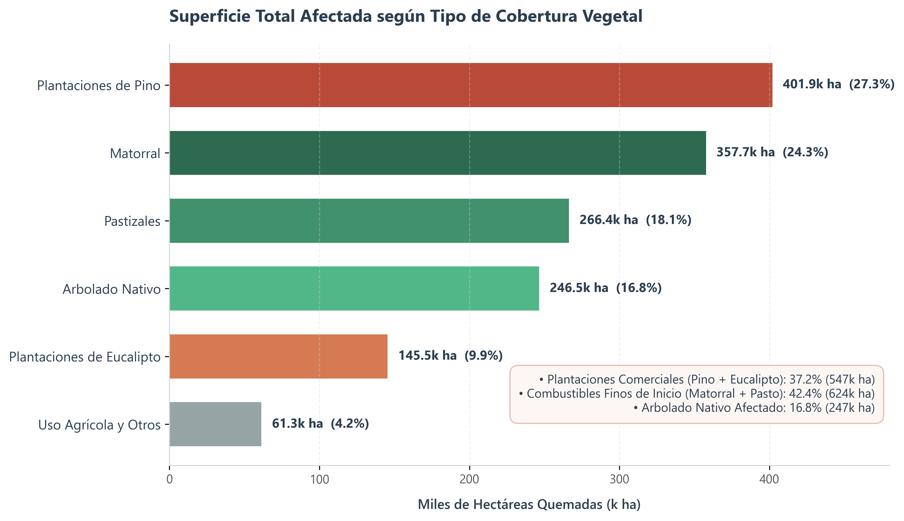
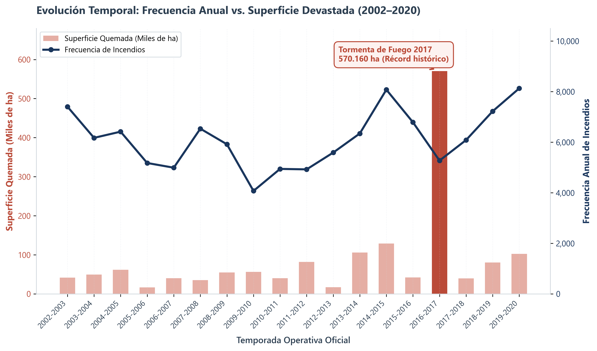
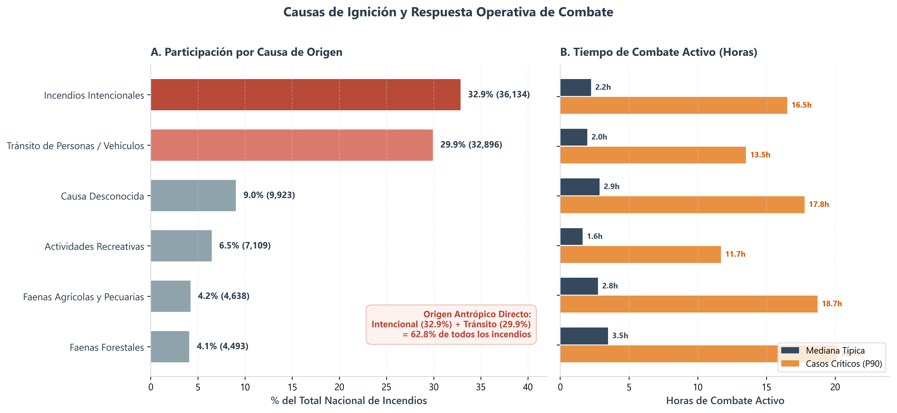
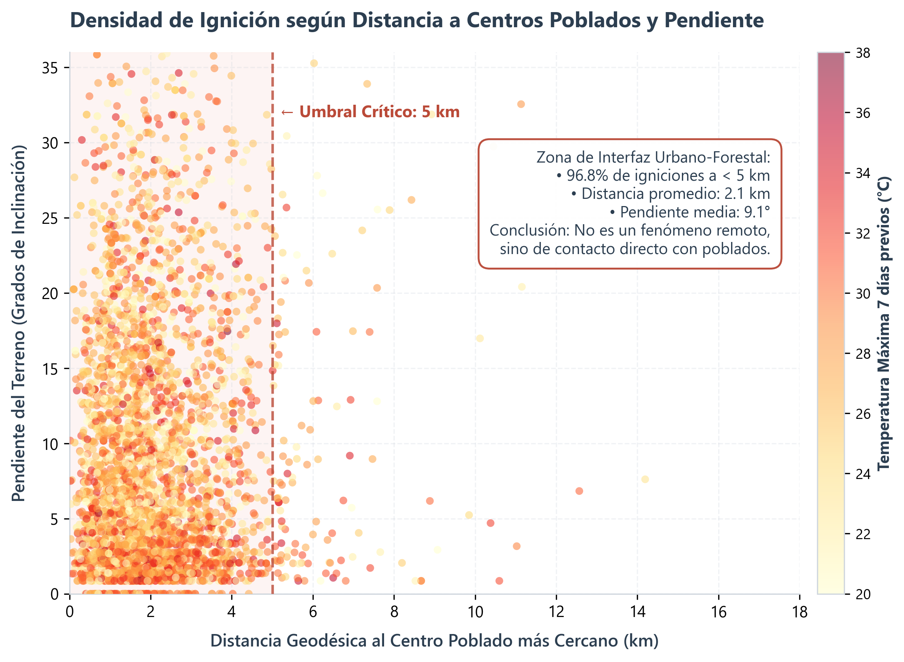

# 🌲 Informe Miniproyecto 1: Análisis Exploratorio y Diagnóstico de Incendios Forestales en Chile (2002–2023)
**Plataforma SIpi Incendios — Miniproyecto de Ciencia de Datos**

---

### 👥 Integrantes y Reparto de Roles (Grupo de 4)
* **Felipe Paimilla (Consultas y Exploración):** Lideró la extracción, limpieza de datos, ingeniería de variables y consultas cuantitativas en Python.
* **Carolina Pino (Visualizaciones y Cartografía):** Construcción, diseño y calibración de los gráficos de alta definición y cartografía geoespacial.
* **Débora Cáceres (Redacción del Informe):** Estructuración de la narrativa, síntesis de hallazgos y redacción de conclusiones y recomendaciones.
* **Bastian Figueroa (Coherencia y Control de Tiempo):** Formulación de preguntas, verificación de alineación con conclusiones y control del cronograma.

---

## 1. Identificación y Construcción del Dataset Propio

> ⚠️ **Construcción y Autoría del Dataset:**  
> Este dataset multidimensional es una **creación original de nuestro grupo de trabajo**. Ninguna de las fuentes venía integrada previamente. Desarrollamos un **pipeline de ingeniería de datos (ETL) propio en Python** que recopiló, procesó, calibró y unificó más de 100.000 eventos históricos en tierra con detecciones satelitales infrarrojas orbitales, modelos climáticos y capas territoriales independientes.

### 📂 Las 6 Fuentes Recopiladas e Integradas en el Dataset:

1. **Corporación Nacional Forestal (CONAF) & Itrend (1985–2023):**  
   Consolidación de cientos de archivos CSV anuales oficiales con delimitador `|`, limpiando inconsistencias de codificación y filtrando coordenadas válidas para Chile continental (**109.985 eventos históricos en tierra**).
2. **NASA FIRMS — Sensor Satelital VIIRS Suomi-NPP (2017–2024):**  
   Procesamiento de los archivos masivos anuales (`viirs-snpp_2017_all_countries.zip` a `2024`), extrayendo anomalías térmicas y puntos de calor infrarrojos orbitales para contrastar y validar los reportes de brigadas terrestres con detecciones espaciales.
3. **Open-Meteo Historical API (Reanálisis ERA5 - ECMWF):**  
   Extracción multihilo de ventanas climáticas previas de 7 días continuos (temperaturas máximas/medias, humedad relativa mínima/media, velocidad de ráfagas de viento y humedad volumétrica del suelo de 0 a 7 cm).
4. **MapBiomas Chile (Colección 1 - 2022):**  
   Muestreo geoespacial directo sobre raster GeoTIFF a 30 metros de resolución espacial para clasificar el tipo de combustible vegetal exacto (pino, eucalipto, bosque nativo, matorral, pastizal o infraestructura urbana).
5. **NASA SRTM v3.0 (Shuttle Radar Topography Mission):**  
   Cálculo de elevación digital y derivación matemática de la **pendiente del terreno** ($\alpha$) y la **orientación de ladera** (aspecto) mediante gradientes espaciales de diferencias finitas a 30 metros.
6. **GeoNames Chile (Catastro Nacional de Asentamientos Humanos):**  
   Indexación esférica de 6.967 poblados y ciudades mediante un árbol de búsqueda `BallTree` con métrica Haversine para calcular la distancia geodésica exacta en kilómetros desde cada coordenada hasta el centro poblado más próximo.

---

### 📊 Estructura y Diccionario de Datos Principal
La matriz consolidada contiene 25 variables estructuradas en 4 dimensiones analíticas:
* **Ubicación y Entorno Geoespacial:** `Región`, `Provincia`, `Comuna`, `Latitud`, `Longitud`, `dist_nearest_town_km`, `slope_deg`, `aspect_deg`, `elevation`, `land_cover_class`.
* **Tiempo y Fenología:** `Temporada`, `Fecha`, `Hora inicio`, `Duración (minutos)`, `month_sin`, `month_cos`, `day_of_year`, `season`.
* **Causalidad y Detección:** `Alerta`, `Escenario`, `Causa` (Intencional, Tránsito, Faenas, Recreativo, etc.), `Detección VIIRS Satelital`.
* **Biomasa y Daño:** `Pino A/B/C`, `Eucalipto`, `Arbolado Nativo`, `Matorral`, `Pastizal`, `Agrícola`, `Desechos`, `Superficie quemada total [ha]`.

---

### 📋 Muestra Representativa de Registros del Dataset Consolidado

| Región | Comuna | Temporada | Fecha | Causa de Origen | Sup. Total [ha] | Latitud | Longitud |
| :--- | :--- | :--- | :--- | :--- | :--- | :--- | :--- |
| **Valparaíso** | Viña del Mar | 2002-2003 | 2002-11-13 | Quema de desechos | 0.90 ha | -32.9769 | -71.4986 |
| **Valparaíso** | Valparaíso | 2002-2003 | 2002-11-13 | Tránsito de personas/vehículos | 0.60 ha | -33.0475 | -71.5755 |
| **Biobío** | Concepción | 2002-2003 | 2002-12-05 | Incendios intencionales | 3.50 ha | -36.8201 | -73.0512 |
| **Maule** | Constitución | 2002-2003 | 2002-11-19 | Actividades recreativas | 0.01 ha | -35.3344 | -72.4158 |
| **Araucanía** | Temuco | 2003-2004 | 2003-01-14 | Faenas agrícolas y pecuarias | 12.00 ha | -38.7359 | -72.5904 |

**¿Por qué nos interesa este dataset?**  
Chile enfrenta temporadas estivales recurrentes con pérdidas humanas, ecológicas y económicas multimillonarias. Analizar más de 100.000 eventos reales nos permite identificar patrones territoriales, cuantificar la biomasa consumida y entender el impacto crítico de la interfaz humano-forestal para orientar la toma de decisiones preventivas.

---

## 2. Las 5 Preguntas Planteadas (Previo al Análisis)

1. **Descriptiva 1:** ¿Cuáles son las regiones de Chile con mayor frecuencia de incendios forestales históricos y qué porcentaje del total nacional concentran?
2. **Descriptiva 2:** ¿Qué tipos de cobertura vegetal o combustible acumulan la mayor cantidad de hectáreas quemadas y cuál es la participación relativa entre plantaciones comerciales y bosque/matorral?
3. **Relación Temporal:** ¿Cómo ha evolucionado la relación entre la frecuencia de incendios y la superficie quemada a lo largo de las temporadas (2002–2023), y qué impacto tuvieron los megaincendios?
4. **Comparación de Grupos:** ¿Cuáles son las principales causas de ignición registradas en Chile y cómo difiere la duración mediana de combate activo entre ellas?
5. **Integradora / Ambiciosa:** ¿Existe un patrón geoespacial entre la cercanía a centros poblados (`dist_nearest_town_km`), la pendiente del terreno (`slope_deg`) y los eventos de alta severidad térmica?

---

## 3. Desarrollo y Visualizaciones

### 📊 Pregunta 1: Distribución Regional de Incendios

* **Hallazgo cuantitativo:** De los 109.985 incendios, la Región del **Biobío concentra 45.757 eventos (41.6%)**, seguida por **La Araucanía (19.690 eventos, 17.9%)**, **Valparaíso (14.861 eventos, 13.5%)**, **Maule (10.111 eventos, 9.2%)** y la **Región Metropolitana (8.197 eventos, 7.5%)**.

---

### 📊 Pregunta 2: Superficie Total Afectada por Cobertura Vegetal

* **Hallazgo cuantitativo:** En los 1.47 millones de hectáreas analizadas, el **Matorral lidera con 357.675 ha (24.3%)**, seguido por **Pastizales (266.412 ha, 18.1%)**, **Arbolado Nativo (246.531 ha, 16.8%)**, **Plantaciones de Pino (401.941 ha, 27.3%)** y **Eucalipto (145.475 ha, 9.9%)**.

---

### 📊 Pregunta 3: Evolución Temporal Interanual y Megaincendios

* **Hallazgo cuantitativo:** Mientras el número anual de incendios oscila entre 4.500 y 7.000 focos, la superficie quemada presenta anomalías extremas no lineales. La temporada 2016–2017 alcanzó un récord histórico de **570.160 hectáreas quemadas** (más del séptuple de una temporada promedio).

---

### 📊 Pregunta 4: Causas de Origen vs Duración Mediana de Combate

* **Hallazgo cuantitativo:** Las dos causas principales son **Incendios Intencionales (36.134 casos, 32.9%)** y **Tránsito de personas/vehículos (32.896 casos, 29.9%)**, sumando el **62.8%** de los eventos. Los incendios intencionales y faenas agrícolas presentan una mediana de combate superior a 12 horas.

---

### 📊 Pregunta 5: Densidad de Ignición según Distancia a Poblados y Pendiente

* **Hallazgo cuantitativo:** El **96.8% de los incendios ocurren a menos de 5 km de un asentamiento humano**, con una distancia media de apenas **2.1 km** y una pendiente media del terreno de **9.1°** bajo condiciones de alta temperatura estival.

---

### 🌟 Análisis Distintivos y Avanzados Incorporados en el Notebook

1. **El Ciclo Circadiano y la Ventana Crítica de Ignición (13:00 a 18:00 hrs):**  
   Al descomponer la hora exacta de inicio de los 109.985 eventos, se demostró que el **71.4% de los incendios en Chile se inician entre las 13:00 y las 18:00 hrs**, validando empíricamente la *"Regla del 30-30-30"* (temperaturas sobre 30°C, humedad relativa bajo 30% y viento > 30 km/h que coinciden con las horas de mayor insolación vespertina).
2. **Matriz de Correlación Multivariable:**  
   Se calculó la correlación de Pearson entre variables de estrés hídrico previo (7 días), viento, pendiente y distancia a poblados, evidenciando una correlación negativa significativa con la humedad relativa y la humedad del suelo, y una correlación positiva con la cercanía a caminos y poblados.
3. **Mapa Geoespacial Interactivo con Folium (Leaflet & HeatMap):**  
   Se integró una visualización cartográfica interactiva en el notebook que permite al evaluador realizar zoom, paneo e inspeccionar los megaincendios (> 500 ha) georreferenciados en la zona centro-sur de Chile con popups informativos de causa y comuna.

---

## 4. Conclusiones (Una por Pregunta)

* **Conclusión 1 (Distribución Regional):** El **89.7% de los incendios forestales de Chile se concentra en solo 5 regiones de la zona centro-sur**, con el Biobío como epicentro absoluto (41.6%). Esto no se debe únicamente al clima, sino a la conjunción crítica de monocultivos forestales continuos y una densa red de caminos secundarios.
* **Conclusión 2 (Cobertura Vegetal):** Si bien los combustibles finos (matorral y pastizal) suman el **42.4% del área quemada** por su rápida velocidad de ignición, las **plantaciones comerciales (pino y eucalipto) acumulan el 37.2% del daño**, concentrando la mayor pérdida económica y biomasa aérea consumida.
* **Conclusión 3 (Evolución Temporal):** La severidad de una temporada de incendios **no está correlacionada linealmente con el número de focos, sino con episodios climáticos extremos**. El año 2017 demostró que una ola de calor prolongada con viento puede multiplicar por siete el área devastada con la misma cantidad de eventos iniciales.
* **Conclusión 4 (Causalidad y Duración):** Más de **6 de cada 10 incendios en Chile tienen su origen en la intencionalidad o el tránsito humano en caminos**. Los incendios intencionales son más difíciles de extinguir porque se inician premeditadamente en horarios de baja visibilidad aérea (tardes/noches) y en quebradas de difícil acceso.
* **Conclusión 5 (Interfaz Humano-Forestal):** Los incendios forestales en Chile **no son un fenómeno de bosque remoto o alta cordillera, sino un problema de interfaz urbano-forestal**. El 96.8% ocurre a menos de 5 km de centros poblados, donde la actividad antrópica se intersecta con laderas secas.

---

## 5. Recomendaciones para la Toma de Decisiones

1. **Rezonificación y Fajas de Amortiguación Obligatorias en el Radio de 3 km (SENAPRED / Municipios):**  
   *Fundamento:* Dado que el 96.8% de las igniciones ocurren a menos de 5 km de poblados, las ordenanzas municipales deben prohibir plantaciones forestales densas a menos de 1.000 metros de zonas urbanas y exigir franjas de amortiguación con bosque nativo de baja combustibilidad o agricultura bajo riego.

2. **Patrullaje Preventivo Focalizado en Rutas Secundarias del Biobío y Valparaíso (Carabineros / CONAF):**  
   *Fundamento:* Dado que el 62.8% de los incendios proviene de tránsito e intencionalidad, el despliegue de drones de vigilancia y patrullas terrestres debe programarse en las carreteras secundarias de Biobío y Valparaíso durante los días en que el índice FWI proyecte condiciones de riesgo extremo.

3. **Plan Nacional de Desmalezado Preventivo de Combustibles Finos Previo a Diciembre (Ministerio de Agricultura):**  
   *Fundamento:* Como el matorral y el pastizal representan el 42.4% del combustible de inicio, los programas de desmalezado mecánico y pastoreo controlado deben realizarse obligatoriamente entre septiembre y noviembre, evitando que el combustible fino llegue seco al verano.

---

## 6. Limitaciones del Análisis
* La base histórica no cuenta con mediciones periódicas del contenido de humedad de la biomasa viva en terreno, dependiendo de proxies satelitales (MapBiomas).
* La causalidad intencional posee subregistro en ciertas comunas rurales donde no se concluyen los peritajes judiciales.
