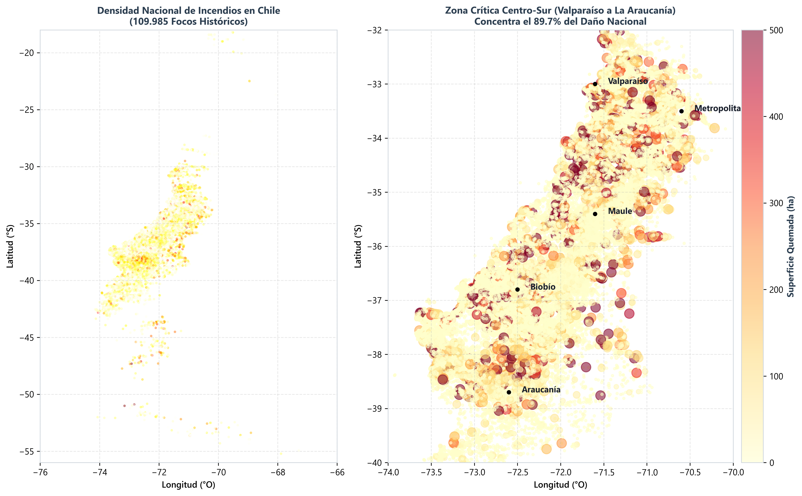
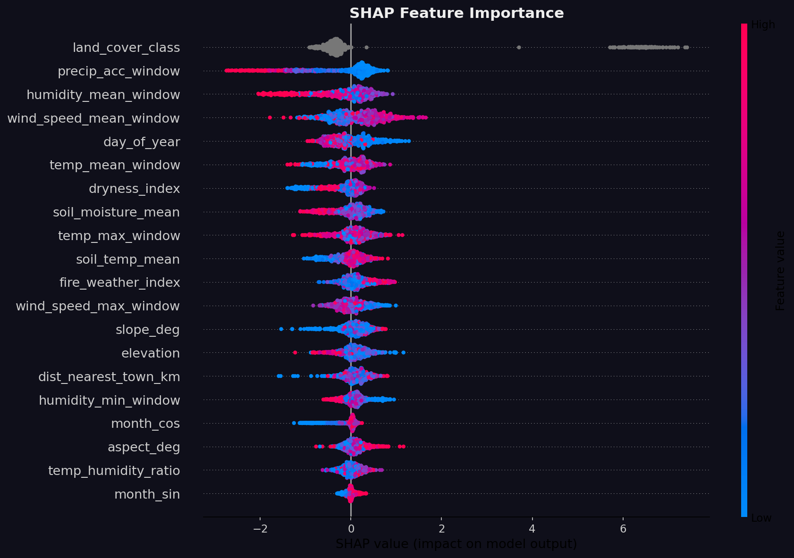
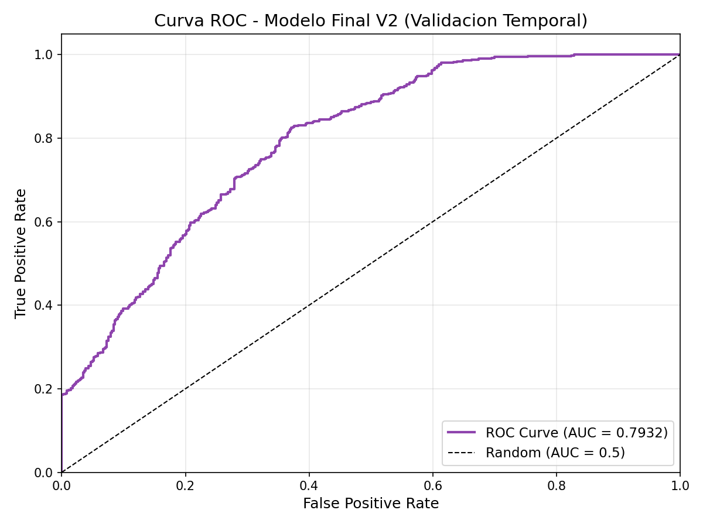
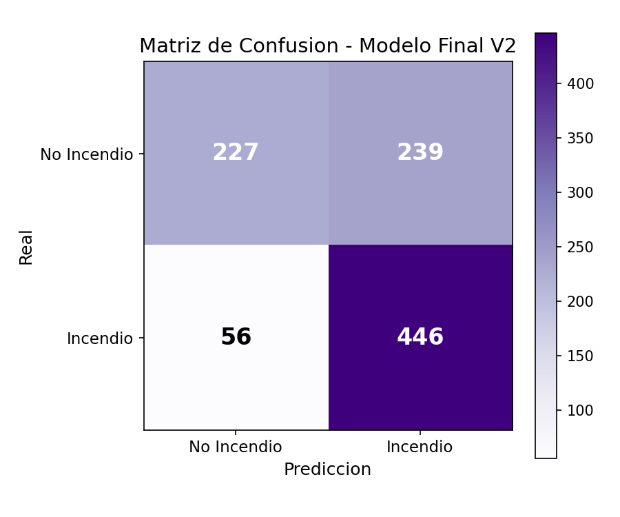

<div align="center">

# 🔥 SIpi Incendios
### Sistema Inteligente de Predicción, Diagnóstico y Simulación de Riesgo de Incendios Forestales en Chile

[](https://www.python.org/)
[](https://xgboost.readthedocs.io/)
[](https://flask.palletsprojects.com/)
[](https://leafletjs.com/)
[]()
[]()
[]()

<p align="center">
  <b>Plataforma integral de Machine Learning y visualización geoespacial interactiva para Chile continental.</b><br>
  Integra registros históricos oficiales de <b>CONAF/Itrend</b> (2002–2023), capas de uso de suelo <b>MapBiomas 2022</b>, topografía digital <b>NASA SRTM</b>, catálogo de asentamientos <b>GeoNames</b>, meteorología en tiempo real vía <b>Open-Meteo API</b> y explicabilidad local en vivo mediante <b>SHAP</b>.
</p>

</div>

---

## 👥 Equipo de Desarrollo e Integrantes

<div align="center">

| Integrante | Rol en el Proyecto | Responsabilidades Principales |
|---|---|---|
| **🌲 Carolina Pino** | **Visualizaciones y Cartografía** | Construcción, diseño y calibración de los gráficos de alta definición, paletas cromáticas accesibles, cartografía geoespacial interactiva y diseño visual del dashboard. |
| **⚡ Felipe Paimilla** | **Ingeniería de Datos y Machine Learning** | Liderazgo del pipeline ETL, extracción multihilo de clima, ingeniería de las 22 variables, entrenamiento del modelo XGBoost, optimización bayesiana con Optuna y arquitectura backend. |
| **📝 Débora Cáceres** | **Redacción Técnica y Síntesis** | Estructuración de la narrativa técnica, análisis cuantitativo de resultados, redacción de los informes de ingeniería y formulación de recomendaciones preventivas para políticas públicas. |
| **🎯 Bastian Figueroa** | **Coherencia y Control de Calidad** | Formulación y validación de preguntas de negocio, pruebas de alineación analítica entre datos y conclusiones, verificación del modelo y control del cronograma de entrega. |

</div>

---

## 🌐 Visualizador Web en Línea (Demo Interactiva)

El proyecto está preparado para ser consumido directamente en la nube como una SPA (Single Page Application) interactiva sin requerir instalación:

<div align="center">

[](https://render.com)

</div>

### Despliegue Gratuito en 2 Minutos (vía Render.com)
1. Inicia sesión en **[Render.com](https://render.com)** con tu cuenta de GitHub.
2. Selecciona **New +** → **Web Service** y vincula el repositorio `Paimilla/Sipi_incendios`.
3. Configura los parámetros básicos (detectados automáticamente por `render.yaml`):
   - **Environment:** `Python`
   - **Build Command:** `pip install -r requirements.txt`
   - **Start Command:** `gunicorn app:app --workers 2 --timeout 120`
   - **Instance Type:** `Free ($0/mes)`
4. Haz clic en **Deploy Web Service**. Render te proporcionará un enlace HTTPS público permanente (ej. `https://sipi-incendios.onrender.com`).

---

## ✨ Características Principales de la Plataforma

```
┌─────────────────────────────────────────────────────────────────────────────────┐
│                               MODULOS DEL SISTEMA                               │
├───────────────────────┬─────────────────────────┬───────────────────────────────┤
│ 📍 PREDICCIÓN PUNTUAL │ 📅 PRONÓSTICO A 7 DÍAS  │ 🧪 SIMULADOR WHAT-IF          │
│ • Mapa Leaflet oscuro │ • Consulta Open-Meteo   │ • 5 Sliders en vivo (T°, Hum) │
│ • Tacómetro de Riesgo │ • Curva de riesgo 7d    │ • Escenarios: Ola de Calor,   │
│ • Desglose SHAP vivo  │ • Tendencia de peligro  │   Viento Puelche, Lluvia      │
│ • Focos CONAF 2002-23 │ • Recomendación alerta  │ • Cálculo de deltas de riesgo │
└───────────────────────┴─────────────────────────┴───────────────────────────────┘
```

1. **📍 Predicción Puntual y Entorno Geoespacial:**
   - Haz clic en cualquier coordenada de Chile continental sobre el mapa interactivo.
   - El sistema calcula de forma instantánea la distancia al poblado más cercano (`GeoNames`), el tipo de cobertura vegetal (`MapBiomas 2022`), la pendiente y elevación (`NASA SRTM`) y el clima en vivo (`Open-Meteo`).
   - El tacómetro indica el nivel de riesgo: **Bajo**, **Moderado**, **Alto** o **Crítico**.
   - **Explicabilidad SHAP en vivo:** Muestra con precisión qué factores climáticos o territoriales están empujando el riesgo al alza o a la baja en ese punto exacto.

2. **📅 Pronóstico de Riesgo a 7 Días:**
   - Proyecta la evolución diaria de probabilidad de ignición para los próximos 7 días cruzando el pronóstico oficial del modelo ECMWF/IFS.

3. **🧪 Simulador Climático "¿Qué pasaría si...?":**
   - Modifica en tiempo real la temperatura, humedad relativa, viento, pendiente o vegetación con barras deslizantes interactivas para evaluar el impacto preventivo (ej. reemplazar plantación de pino por arbolado nativo o simular un evento 30-30-30).

4. **📊 Diagnóstico y Métricas del Modelo:**
   - Visualizador de métricas de generalización y galería de gráficos analíticos de diagnóstico en alta resolución con lightbox integrado.

---

## 📈 Visualizaciones y Diagnóstico del Modelo

<div align="center">

| Mapa Geoespacial de Incendios en Chile | Importancia de Variables (SHAP Summary) |
|:---:|:---:|
|  |  |

| Curva ROC (AUC: 0.7932) | Matriz de Confusión |
|:---:|:---:|
|  |  |

</div>

---

## 🧠 Variables del Modelo de Machine Learning (22 Features)

El modelo **XGBoost V2** utiliza 22 variables calibradas mediante validación temporal estricta (entrenamiento con datos 2002–2018 y evaluación ciega con datos 2019–2020):

| Categoría | Variable | Significado Físico / Algorítmico | Fuente de Datos |
|---|---|---|---|
| **Clima (7 Días)** | `temp_max_window` | Temperatura máxima acumulada | Open-Meteo ERA5 |
| | `temp_mean_window` | Temperatura media sostenida | Open-Meteo ERA5 |
| | `humidity_min_window` | Humedad relativa crítica mínima (%) | Open-Meteo ERA5 |
| | `humidity_mean_window` | Humedad relativa media del aire (%) | Open-Meteo ERA5 |
| | `precip_acc_window` | Milímetros de lluvia acumulada (7d) | Open-Meteo ERA5 |
| | `wind_speed_max_window` | Ráfaga máxima de viento (km/h) | Open-Meteo ERA5 |
| | `wind_speed_mean_window`| Velocidad media del viento | Open-Meteo ERA5 |
| | `soil_temp_mean` | Temperatura del suelo (0-7 cm) | Open-Meteo ERA5 |
| | `soil_moisture_mean` | Humedad volumétrica del suelo | Open-Meteo ERA5 |
| **Vegetación** | `land_cover_class` | Clase de combustible vegetal (30m) | MapBiomas Chile 2022 |
| **Antrópico** | `dist_nearest_town_km` | Distancia geodésica al poblado más cercano | GeoNames (BallTree) |
| **Topografía** | `elevation` | Altitud sobre el nivel del mar (m) | NASA SRTM v3.0 |
| | `slope_deg` | Pendiente topográfica del terreno (°) | NASA SRTM v3.0 |
| | `aspect_deg` | Orientación de ladera (0°=N, 180°=S) | NASA SRTM v3.0 |
| **Temporal** | `month_sin`, `month_cos` | Modelado cíclico orbital del mes | Calendario |
| | `day_of_year` | Día del año (1–366) | Calendario |
| | `season` | Estación del año hemisferio sur | Calendario |
| **Interacción** | `dryness_index` | Índice de desecación del combustible | Derivada |
| | `precip_drought` | Indicador binario de sequía extrema | Derivada |
| | `temp_humidity_ratio` | Tasa de evaporación atmosférica | Derivada |
| | `fire_weather_index` | Índice de Peligro Meteorológico FWI | Derivada |

---

## 🎯 Rendimiento Evaluado (Conjunto Ciego 2019–2020)

* **Área bajo la curva ROC (ROC-AUC):** `0.7932`
* **Puntuación F1 (F1-Score):** `0.7515`
* **Precisión Promedio (PR-AUC):** `0.7975`
* **Sensibilidad / Recall de Incendios:** `88.84%` *(prioridad clave: minimizar falsos negativos)*
* **Exactitud Global (Accuracy):** `69.52%`
* **Brier Score (Calibración Probabilística):** `0.2221`

---

## 🏗️ Arquitectura del Repositorio

```
SIpi_incendios/
├── app.py                            # Entrypoint principal WSGI para producción (Gunicorn/Local)
├── Procfile                          # Instrucción de ejecución para PaaS (Render, Railway, Heroku)
├── render.yaml                       # Despliegue en 1 clic automatizado en Render.com
├── requirements.txt                  # Dependencias de producción depuradas y optimizadas
├── .gitignore                        # Exclusión de binarios pesados (>100MB) y temporales
├── README.md                         # Portada oficial del proyecto y documentación
├── INFORME_SISTEMA_SIPI_INCENDIOS.md # Memoria técnica detallada de ingeniería del sistema
├── INFORME_MINIPROYECTO.md           # Informe de Ciencia de Datos y Análisis Exploratorio (EDA)
├── Miniproyecto_SIpi_Incendios.ipynb # Notebook ejecutable con los análisis y gráficos del informe
├── src/
│   ├── config.py                     # Constantes geográficas de Chile y rutas relativas
│   ├── data/                         # Pipeline ETL geoespacial y de clima
│   │   ├── merge_itrend.py           # Unificación de fuentes CONAF/Itrend
│   │   ├── fetch_weather.py          # Extracción meteorológica multihilo
│   │   ├── create_dataset.py         # Muestreo inteligente de datos positivos/negativos
│   │   ├── download_mapbiomas.py     # Descargador automatizado de coberturas
│   │   ├── add_spatial_features.py   # Mapeo espacial de uso de suelo
│   │   ├── add_anthropogenic.py      # Distancia a centros urbanos (GeoNames BallTree)
│   │   ├── add_topography.py         # Elevación y pendientes (NASA SRTM)
│   │   └── process_viirs.py          # Extracción de anomalías térmicas satelitales
│   ├── models/                       # Modelos serializados y entrenamiento
│   │   ├── train_model_final.py      # XGBoost + Optuna + Split Temporal
│   │   ├── xgboost_fire_model_final.pkl # Modelo listo para inferencia (1.66 MB)
│   │   └── model_metadata_final.pkl  # Metadatos institucionales y calibración
│   ├── evaluation/                   # Diagnóstico y explicabilidad SHAP
│   │   ├── evaluate_model.py         # Generador de curvas y reportes
│   │   ├── evaluation_report.json    # Métricas estructuradas para el visualizador
│   │   └── *.png                     # Gráficos diagnósticos de alta definición
│   └── dashboard/                    # Visualizador Web Interactivo
│       ├── server.py                 # Backend Flask con inferencia, SHAP y Open-Meteo
│       └── static/                   # Frontend SPA Glassmorphism (HTML5 / Vanilla JS / CSS3)
│           ├── index.html            # Dashboard modular con 4 pestañas interactivas
│           ├── css/styles.css        # Hoja de estilos moderna y adaptable
│           └── js/app.js             # Lógica cliente, tacómetro dinámico y gráficos
├── data/
│   ├── raw/                          # Insumos esenciales (GeoNames CL.txt para poblados)
│   └── processed/                    # Muestra histórica georreferenciada de focos
└── tests/                            # Suite completa de pruebas unitarias (17 tests)
    ├── test_features.py              # Validación de cálculos e índices derivados
    ├── test_model.py                 # Validación de inferencia y explicaciones SHAP
    └── test_server.py                # Pruebas de integración de la API REST
```

---

## 💻 Instalación y Ejecución Local

### 1. Clonar el repositorio
```bash
git clone https://github.com/Paimilla/Sipi_incendios.git
cd Sipi_incendios
```

### 2. Crear y activar entorno virtual
```bash
python -m venv venv

# En Windows:
venv\Scripts\activate

# En Linux o macOS:
source venv/bin/activate
```

### 3. Instalar dependencias
```bash
pip install -r requirements.txt
```

### 4. Ejecutar la suite de pruebas automatizadas
```bash
python -m pytest tests/ -v
```
*(17 pruebas unitarias ejecutadas cubriendo features, modelos y endpoints de la API).*

### 5. Iniciar la aplicación web
```bash
python app.py
```
Abre en tu navegador web: **`http://localhost:5000`**

---

## 🔒 Seguridad, Portabilidad y Privacidad

* **Cero Tokens o Claves Expuestas:** El código se conecta únicamente a servicios abiertos sin autenticación por token privado (Open-Meteo y NASA SRTM).
* **Rutas Portables:** Todo el proyecto utiliza rutas relativas calculadas dinámicamente mediante `pathlib.Path`, funcionando sin cambios en Windows, Linux y Docker.
* **Optimizado para GitHub:** Los datasets crudos que excedían el límite de 100 MB se encuentran excluidos por `.gitignore`, manteniendo el repositorio ligero (~21 MB) y permitiendo despliegues inmediatos en servidores gratuitos.

---

## 📚 Fuentes de Datos Institucionales

* **CONAF & Itrend:** Base de datos histórica nacional de incendios forestales de Chile (1985–2023).
* **NASA FIRMS:** Detección de anomalías térmicas satelitales VIIRS 375m (Suomi-NPP).
* **Open-Meteo API:** Reanálisis atmosférico ERA5 (ECMWF) y pronósticos globales horarios (GFS/IFS).
* **MapBiomas Chile:** Cobertura de suelo multiclase a 30 metros (Colección 1 - 2022).
* **NASA SRTM:** Shuttle Radar Topography Mission v3.0 (Modelo Digital de Elevación).
* **GeoNames:** Base geográfica oficial de asentamientos humanos y poblados de Chile.

---

<div align="center">
  <b>SIpi Incendios</b> — Proyecto de Ciencia de Datos e Inteligencia Artificial aplicada a la Prevención de Desastres Naturales en Chile.<br>
  <sub>Desarrollado con ❤️ por Carolina Pino, Felipe Paimilla, Débora Cáceres y Bastian Figueroa.</sub>
</div>
